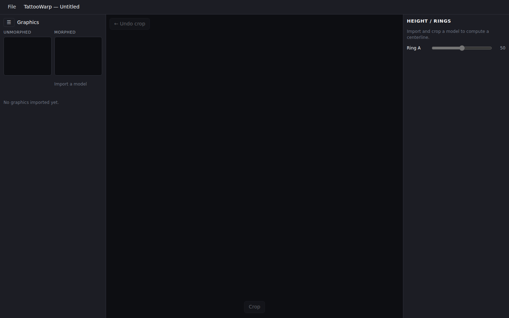
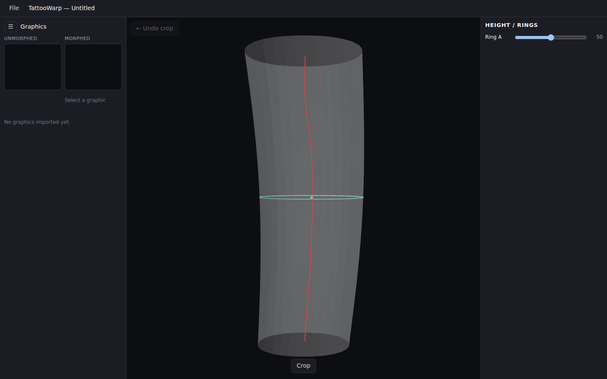
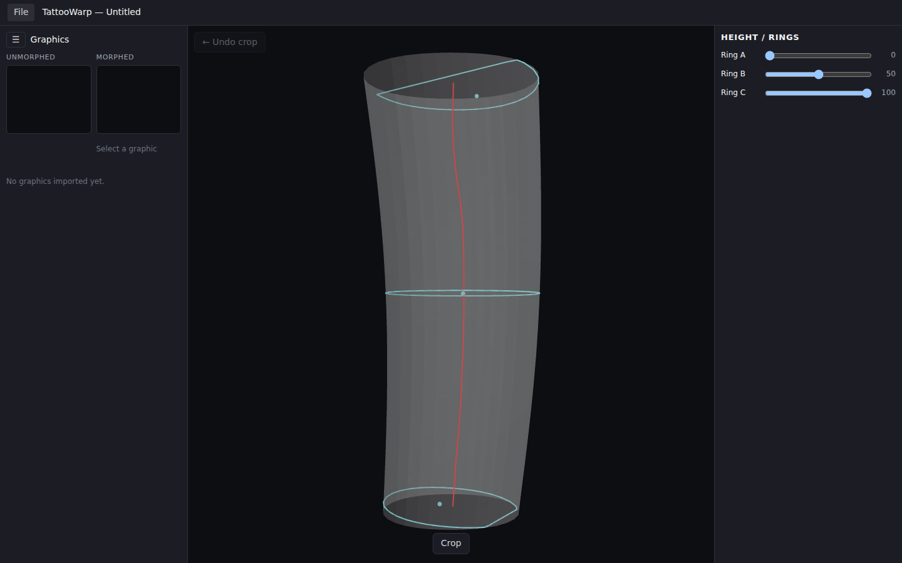
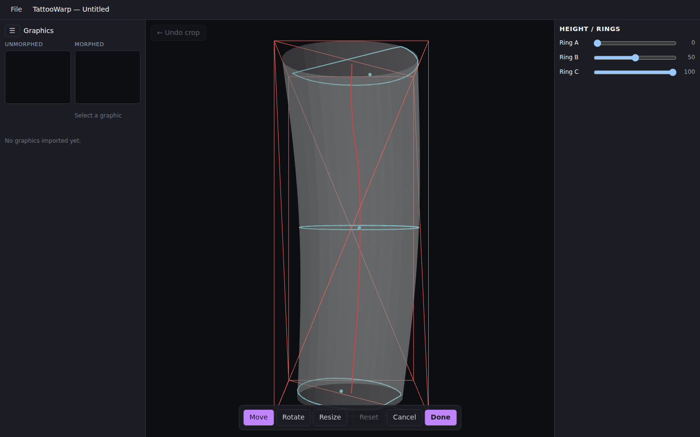
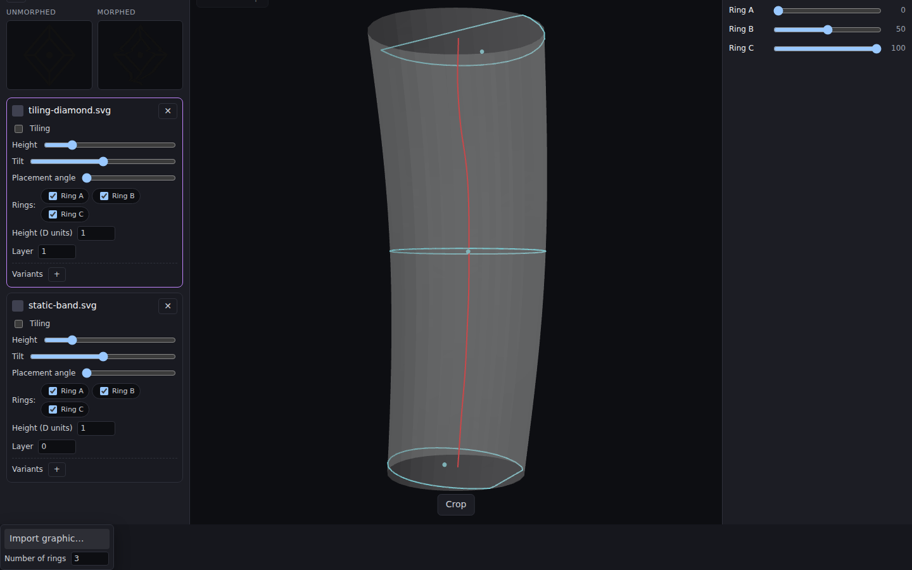
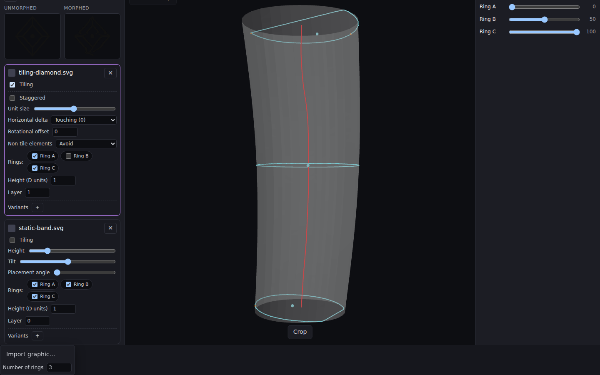
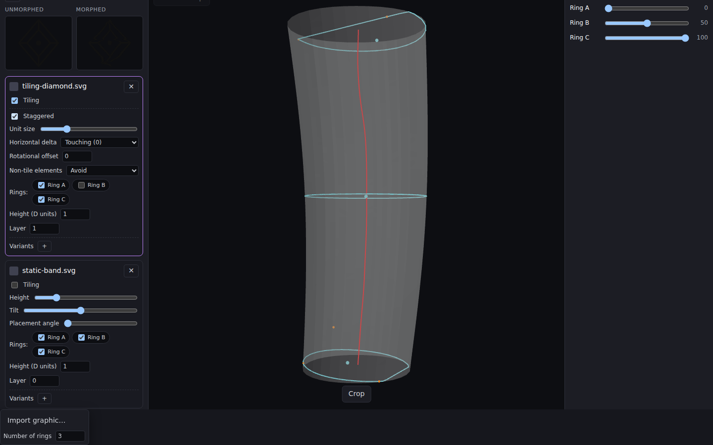
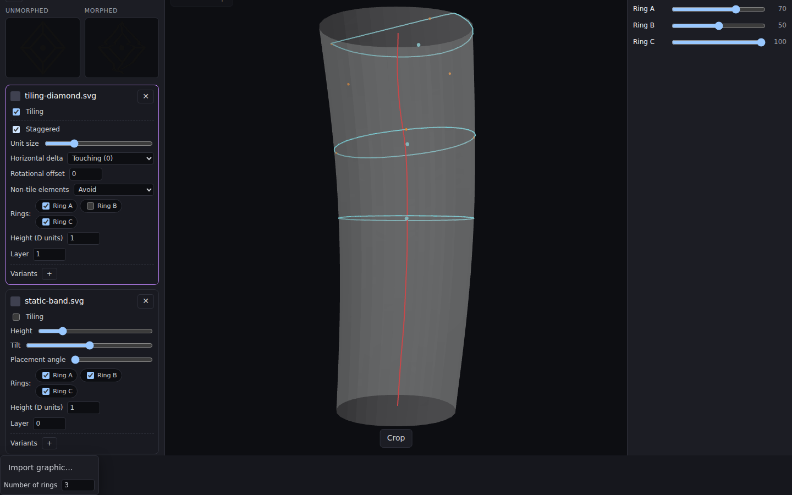

# tattooWarp

An app for pre-warping flat tattoo designs to match a scanned limb's true
curvature, and for laying out tiling/repeating motifs that wrap correctly
around it.

- [`DESIGN.md`](./DESIGN.md) — full design spec (geometry pipeline, UI layout,
  tiling engine, save format).
- [`app/`](./app) — the React + Three.js implementation. See below to run it.

## Examples

Screenshots below were captured against a synthetic sample scan
([`examples/sample-forearm.obj`](./examples/sample-forearm.obj), generated by
[`examples/generate-limb.mjs`](./examples/generate-limb.mjs)) — a tapered,
gently-bent, slightly elliptical tube standing in for a real 3D limb scan —
plus a couple of sample graphics
([`examples/tiling-diamond.svg`](./examples/tiling-diamond.svg),
[`examples/static-band.svg`](./examples/static-band.svg)). You can reproduce
the same walkthrough locally: `cd app && npm run dev`, then **File → Open
model/image…** and pick `examples/sample-forearm.obj`.

| | |
|---|---|
|  Empty project — nothing imported yet. |  A scan imported: the mesh renders semi-transparent with the extracted centerline (red) running through it. |
|  "Number of rings" set to 3 — one height slider per ring in the right sidebar, each with a live cross-section circle. |  Crop mode: a rotate/move/resize gizmo isolates the region of interest before recomputing the centerline. |
|  A static band graphic and a tiling motif imported into the left sidebar's graphics tree, each with its own option tree. |  Tiling turned on for the diamond motif — unit size, stagger, spacing, and non-tile-element handling are all per-graphic options. |
|  Staggered layout solved around the ring's circumference, avoiding the static band's collision box. |  Dragging a ring's height slider moves its cross-section (and everything pinned to it) to a new position along the limb. |

The main-viewer tiling markers currently render as placement-position dots
rather than the final warped artwork — the unmorphed/morphed preview panes on
the left (visible above the graphics tree) are where the actual pre-warped
image output shows up (see the morphed diamond in the tiling screenshots
above); full textured tile rendering directly on the 3D mesh is still open
work.

## Running the app

```sh
cd app
npm install
npm run dev
```

Then use **File → Open model/image…** to import a 3D scan (OBJ/STL/GLTF/GLB/PLY)
or a flat limb photo (2D-fallback mode infers an approximate surface from the
silhouette). Crop to the region of interest, then use the right sidebar's ring
sliders to pick cross-sections and the left sidebar to import and configure
tattoo graphics.

## Desktop app (Linux / Windows / macOS)

The web app is wrapped as a desktop app with [Electron](https://www.electronjs.org/)
and packaged with [electron-builder](https://www.electron.build/), which is
the standard toolchain for shipping a Vite/React app as native installers for
all three desktop platforms.

```sh
cd app
npm install

# Run the desktop app in dev mode (hot-reloading Vite + an Electron window)
npm run electron:dev

# Build an installer for your current platform only (unsigned, local testing)
npm run dist

# Build installers for a specific platform (cross-building linux/win works
# from any host; macOS targets must be built on an actual macOS machine/runner)
npm run dist:linux   # -> release/*.AppImage, *.deb
npm run dist:win     # -> release/*.exe (NSIS installer + portable)
npm run dist:mac     # -> release/*.dmg, *.zip (x64 + arm64)
```

Packaging config lives in [`app/electron-builder.yml`](./app/electron-builder.yml);
the Electron entry point is [`app/electron/main.cjs`](./app/electron/main.cjs).

### Releases

Pushing a tag like `v0.1.0` (or running the **Release** workflow manually from
the Actions tab) triggers [`.github/workflows/release.yml`](./.github/workflows/release.yml),
which builds installers on real Linux/Windows/macOS runners in parallel and
publishes them as assets on a GitHub Release for that tag. Every push/PR to
`main` also runs [`.github/workflows/ci.yml`](./.github/workflows/ci.yml)
(lint + web build) as a fast sanity check.

Artifacts are unsigned (no Apple/Windows signing certs are configured), so
macOS will warn about an unidentified developer and Windows SmartScreen may
flag the installer on first run — expected until signing certs are added.

## Nix

[`flake.nix`](./flake.nix) provides a reproducible dev shell (`nix develop`)
with Node.js and, on Linux, an FHS-compatible environment so Electron's
prebuilt binary (downloaded by npm, not built by Nix) can actually find the
shared libraries it dynamically links against — this matters mainly on
NixOS, where there's no generic `/lib`/`/usr/lib` for a stock Electron binary
to find `libgtk`, `libnss`, etc. against. It's a toolchain shell, not a
hermetic build of the installers themselves: `npm run dist:*` still reaches
out to GitHub to fetch Electron's official per-platform binaries, the same
way virtually every Electron project builds.